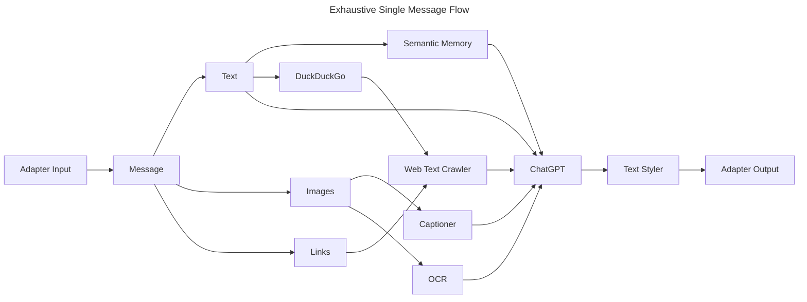

# GPT-me

An experiment to replicate a fully self-sufficient, human-like chatbot that imitates you using various artificial intelligence models.

## Idea

This is the order of steps for how I envision GPT-me functioning.

### Semantic Memories

Memories are still needed for AI self-replication. Unfortunately, large memory file summarization is a huge source of token consumption. One that poor developers like myself cannot afford.

### Document Memories (deprecated)

In order to replicate yourself using AI, memories are needed. In the case of GPT-me, memories would be provided in the form of summarized transcripts of past messages.
The file `scripts/memory.py` will be used to summarize a transcript using a version of [BART](https://huggingface.co/docs/transformers/v4.28.1/en/model_doc/bart) fine tuned on the [samsum](https://huggingface.co/datasets/samsum) dataset. The fine tuned model by [philschmid](https://huggingface.co/philschmid) is found on HuggingFace at [philschmid/distilbart-cnn-12-6-samsum](https://huggingface.co/philschmid/distilbart-cnn-12-6-samsum).

The transcript will be split into several line chunks by the preprocessor, then those chunks will be summarized by BART.
This process is recursive, and will eventually only store the key details of a person in a small summary of their personality.

The general recursive summary idea was mildly inherited from OpenAI's work on [Summarizing books with human feedback](https://openai.com/research/summarizing-books), but using a dedicated summary transformer instead of GPT-3.

### Chatting

1. GPT-me receives a message from some chat app \(many adapters should exist eventually\), this can contain text, links, images, anything.
2. The inputted message is processed and complex elements are simplified. Given links, they content will be crawled and summarized through a route similar to memories. Images should be described by some captioning model \(ex. [nlpconnect/vit-gpt2-image-captioning](https://huggingface.co/nlpconnect/vit-gpt2-image-captioning)\).
3. All provided summary content, along with memories, are passed into a complex gpt-3.5-turbo prompt, which will then carry out the conversation. This prompt will also include a sample of the user's writing style, as to try and emulate that.
4. The generated individual response is sent through the chat app adapter.
5. The generated response will be saved, as well as up to \(roughly\) 10 full exchanges of messages from either side. This maintains and thinks only about the most current information.
6. After an indeterminate period of time or number of messages, a new memories set will be automatically rebuilt and the process continues.

## Styling

_Tl;dr This turned out to be a lot more difficult than I thought it would be._

Initially, styling seemed as easy as just throwing a sample of a user's text into ChatGPT, then having it return a description. This did not work, because if it did, the whole styling section wouldn't be a thing. Text styling is complicated to say the least. So far, I have broken it down into several smaller sub-categories. Some implemented by LLMs, others by old fashioned text processing.

1. Punctuation - This falls down to sentence endings (people use more than just periods in texting), proper capitalization, and commas. All of this can be calculated using basic NLTK text processing. Different punctuation for different types of sentences is also determined for clarity.
2. Contractions - Here, all text contractions are evaluated into percentages: Expanded, proper, and improper. When styling, all contractions are selected over and then randomly transformed based on weighted randoms.
3. Diction - According to [this Grammarly article](https://www.grammarly.com/blog/diction-in-writing/), there are nine types of diction in writing: Formal, informal, pedantic, pedestrian, slang, colloquial, abstract, concrete, and poetic. To find diction, one can throw a sample of text into a classification model such as [roberta-large-mnli](https://huggingface.co/roberta-large-mnli).
4. Length - Everyone has different texting lengths, but instead of finding out different lengths for sentence types, it's easier to just average the word and sentence lengths of a large sample of messages. From here, ask an LLM to rewrite a message using those lengths.
5. Emojis - Purely a word to emoji ratio. Nothing more to say.
6. Mood - A five word description of the texts mood, as determined by [Cohere's Command model](https://docs.cohere.com/docs/models#command).
7. Abbreviations - Just a texting thing, but many texters these days use abbreviations for *many* words. To collect abbreviation usage information, all that is needed is a dataset of common abbreviations. From there, the process is just like contractions.

To apply all of these, the extraction process can essentially be reversed. First, transform the sentence using an LLM. (In this case, Cohere's Command.) These transformations include diction, mood, and length. Just plug those into the prompt and out pops a stylistically transformed sentence. Applying punctuation and grammar is as simple as scanning over the sentences and applying the desired edits. Change out sentence endings probabilistically, give certain sentences proper capitalization, etc. For contractions and abbreviations, just randomly search the sentence for the desired key and then probabilistically swap it out for a contraction or an abbreviation. Adding emojis can be done by simply swapping out random words for their corresponding emojis.

## Sources

Contractions dataset: https://www.kaggle.com/datasets/ishivinal/contractions
Texting acronyms data: https://www.yourdictionary.com/articles/texting-acronyms

## Todo

- [ ] Semantic memory question generation. \(ex. `"Peter hit me with a paper today."` -> `["Who is Peter?", "What happened today?"]`\)
- [x] Integrate web search summaries.
- [x] Adapter example.
- [x] Add image captioner.
- [ ] System to modify message into proper style.
