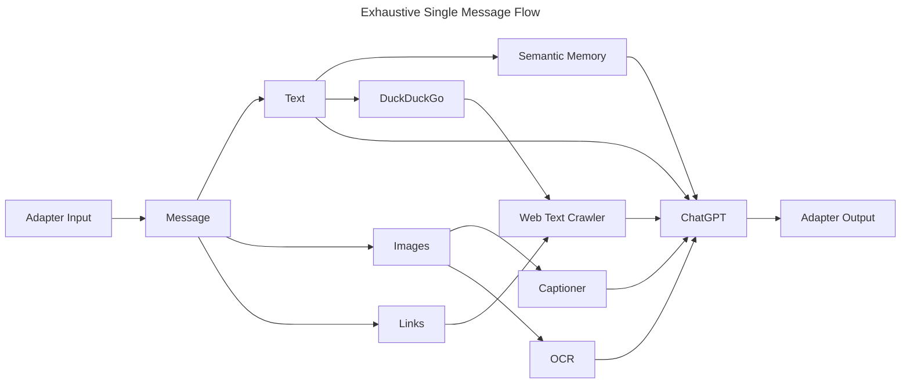

# GPT-me

An experiment to replicate a fully self-sufficient, human-like chatbot that imitates you using various artificial intelligence models.

## Idea

This is the order of steps for how I envision GPT-me functioning.

### Semantic Memories

Memories are still needed for AI self-replication. Unfortunately, large memory file summarization is a huge source of token consumption. One that poor developers like myself cannot afford.

### Document Memories (deprecated)

In order to replicate yourself using AI, memories are needed. In the case of GPT-me, memories would be provided in the form of summarized transcripts of past messages.
The file `scripts/memory.py` will be used to summarize a transcript using a version of [BART](https://huggingface.co/docs/transformers/v4.28.1/en/model_doc/bart) fine tuned on the [samsum](https://huggingface.co/datasets/samsum) dataset. The fine tuned model by [philschmid](https://huggingface.co/philschmid) is found on HuggingFace at [philschmid/distilbart-cnn-12-6-samsum](https://huggingface.co/philschmid/distilbart-cnn-12-6-samsum).

The transcript will be split into several line chunks by the preprocessor, then those chunks will be summarized by BART.
This process is recursive, and will eventually only store the key details of a person in a small summary of their personality.

The general recursive summary idea was mildly inherited from OpenAI's work on [Summarizing books with human feedback](https://openai.com/research/summarizing-books), but using a dedicated summary transformer instead of GPT-3.

### Chatting

1. GPT-me receives a message from some chat app \(many adapters should exist eventually\), this can contain text, links, images, anything.
2. The inputted message is processed and complex elements are simplified. Given links, they content will be crawled and summarized through a route similar to memories. Images should be described by some captioning model \(ex. [nlpconnect/vit-gpt2-image-captioning](https://huggingface.co/nlpconnect/vit-gpt2-image-captioning)\).
3. All provided summary content, along with memories, are passed into a complex gpt-3.5-turbo prompt, which will then carry out the conversation. This prompt will also include a sample of the user's writing style, as to try and emulate that.
4. The generated individual response is sent through the chat app adapter.
5. The generated response will be saved, as well as up to \(roughly\) 10 full exchanges of messages from either side. This maintains and thinks only about the most current information.
6. After an indeterminate period of time or number of messages, a new memories set will be automatically rebuilt and the process continues.

## Todo
[ ] Semantic memory question generation. \(ex. `"Peter hit me with a paper today."` -> `["Who is Peter?", "What happened today?"]`\)
[ ] Integrate web search summaries.
[ ] Adapter example.
[ ] Add image captioner.
[ ] System to modify message into proper style.
